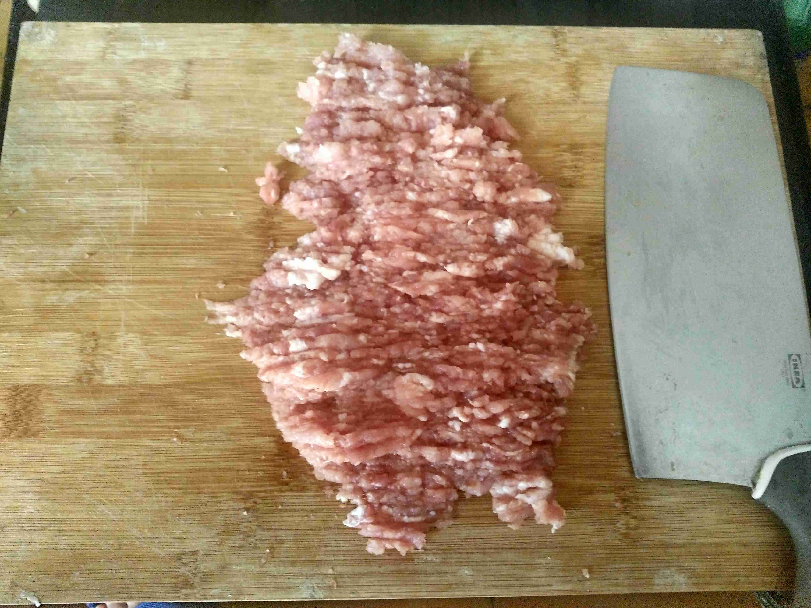
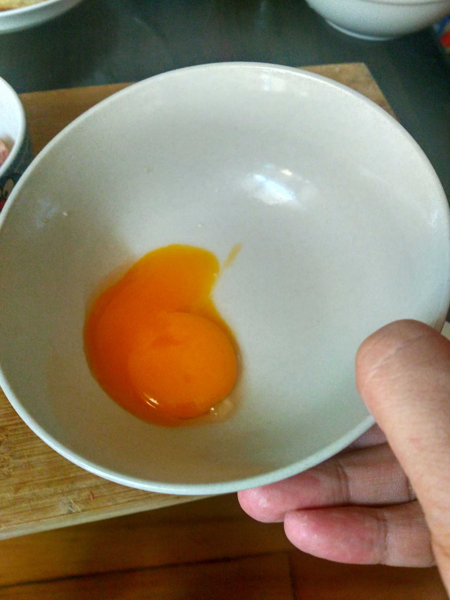
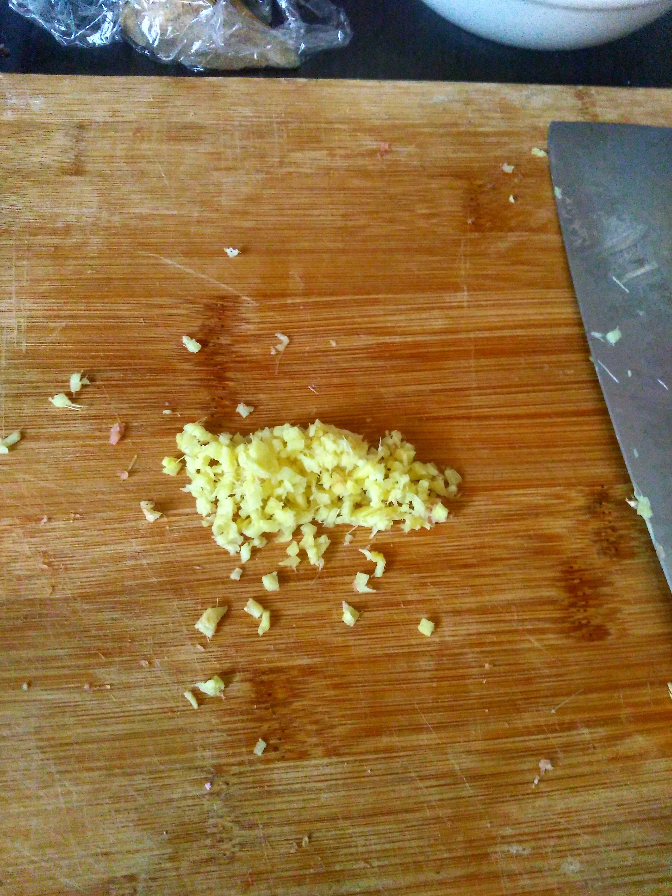
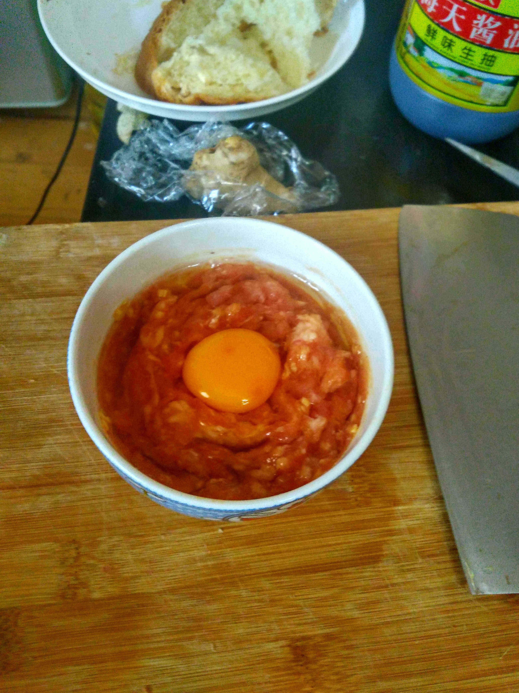
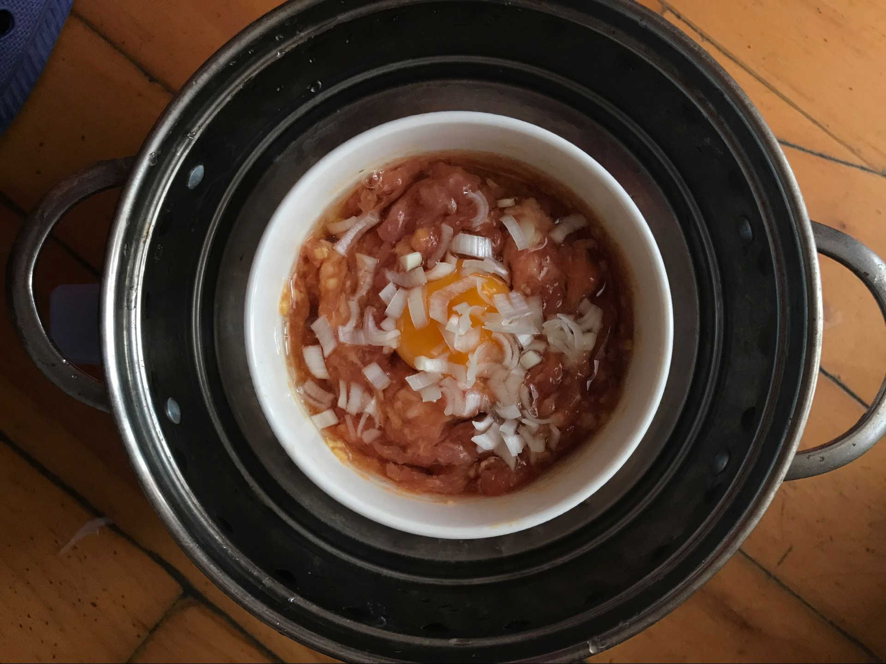
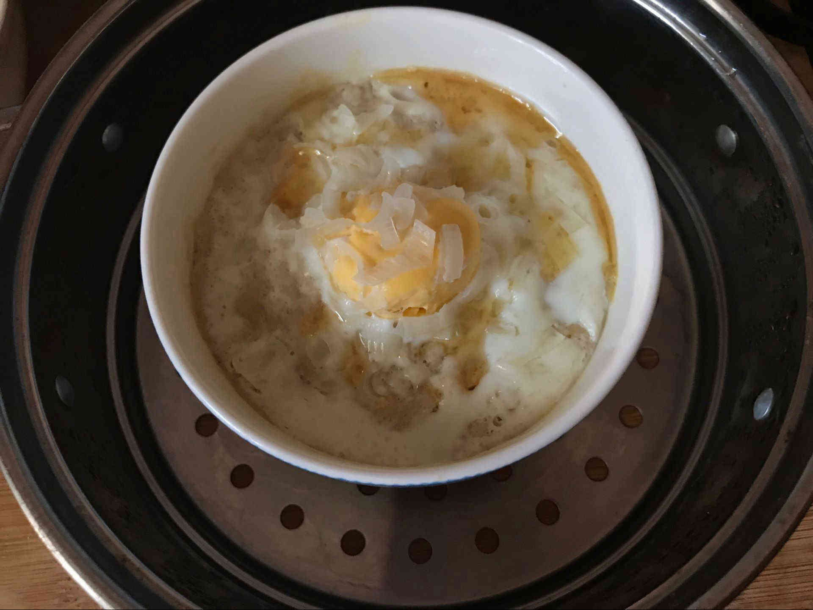

	又是一个睡到自然醒的周末，可悲的是我每到每到周末总是67点就睡不着了，从来就没有过睡到九点的经历，真不想浪费休息日的每一秒钟，尽情的玩，尽情的嗨。
	但是周末也有痛苦的时刻，那就是周末吃啥，不想起来，不想做饭，让我再刷一会手机。不单单是周末，上班也是，几个人每天都会为中午吃啥纠结，虽然每天都会去楼上的大食堂吃同样的饭（PS：我公司在地下室-2，吃饭的时候才会到上面-1楼的大食堂，每天只能见到一会阳光，呼吸一会新鲜空气，所以我离开了）。大食堂有我很喜欢吃的一道菜叫做“肉末蒸蛋“，每次去大食堂都会吃，说不上理由，就是喜欢吃。今天偶发奇想，要不要尝试做一下这道菜，想想都兴奋,（这里有两个哈哈表情,加上以后会乱码！）。
	下面就隆重介绍这道菜的做法（自己百度后总结的，哈哈）：
	所需食材：
		1.精猪肉200克左右
		2.鸡蛋两枚（其实一个就可以了，我用了两个是因为被我弄砸了一个）
		3.酱油
		4.食盐
		5.老姜（我个人比较喜欢吃老姜，够辣）
		6.葱
        详细步骤，图文并茂：
		1.首先将买好的肉剁成肉末，一定要亲自剁，练习下手腕
	

		2.过滤蛋清和蛋黄，把蛋清和肉搅拌在一起

		3.把姜切成约两毫米的方块

	
		4.放入适量酱油、实验、或者其他的调料，我又加了点胡椒粉，然后把蛋黄放到上面（要在上面弄一块凹地出来，不然蛋黄会散的，亲身经历真的散了，所以又加了个鸡蛋.-_-.）

	
		5.现在还剩下最后一步，把碗放到锅里面就可以蒸了，根据个人喜好，放到锅里后我又加了点葱花。

	
		1s
		2s
		3s
		.
		.	
		.
		.
		.	
		.
		.
		大约过了十分钟，我已经等不及了，已经熟了，看到自己的努力没有白费，真的很嗨皮。

郑重声明：
	本篇内容纯属黑暗料理，非专业人士请勿尝试，食后如若有有不良反应，一切与本人无关。	

<!-- UY BEGIN -->

<!-- UY END -->
	
	